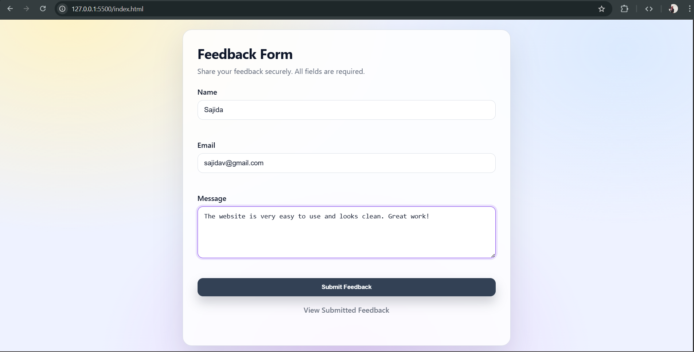
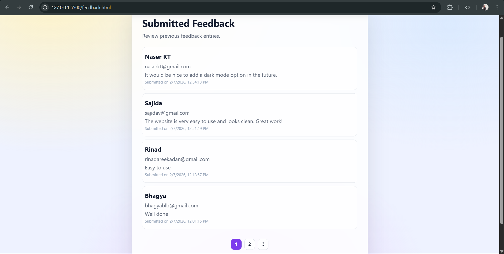
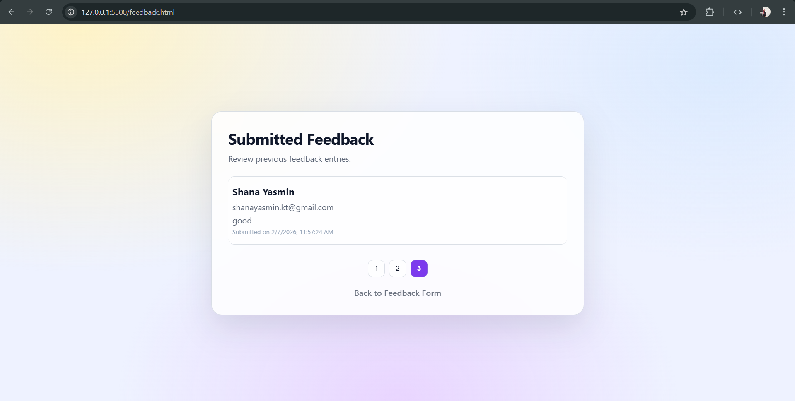

📋 Secure Feedback Form with Local Storage & Pagination

A simple and secure web-based feedback form built using HTML, CSS, and JavaScript.
The application allows users to submit feedback, stores data in the browser’s localStorage, and displays all entries on a dedicated page with pagination. Input validation and sanitization are implemented to prevent common web security vulnerabilities such as Cross-Site Scripting (XSS).

🚀 Features

Feedback form with the following fields:

Name

Email

Message

Stores submitted feedback in localStorage

Displays feedback on a separate page

Pagination to show limited entries per page

Input validation and sanitization for security

Protection against XSS attacks

🛠️ Technologies Used

HTML5

CSS3

JavaScript (Vanilla JS)

Browser LocalStorage API

📂 Project Structure
feedback-form/
├── index.html        # Feedback form page
├── feedback.html     # Feedback listing (admin/view) page
├── style.css         # Styles
├── script.js         # Validation, storage, and display logic
├── screenshots/      # Project screenshots
│   ├── form1.png
│   ├── feedback-list1.png
│   └── feedback-list2.png
└── README.md

## 📸 Screenshots

### Feedback Form

### LocalStorage Data

### Feedback List with Pagination

🔐 Security Implementation

Input validation for empty fields and proper email format

Sanitization to escape unsafe characters (<, >, ", ')

Prevents Cross-Site Scripting (XSS) attacks